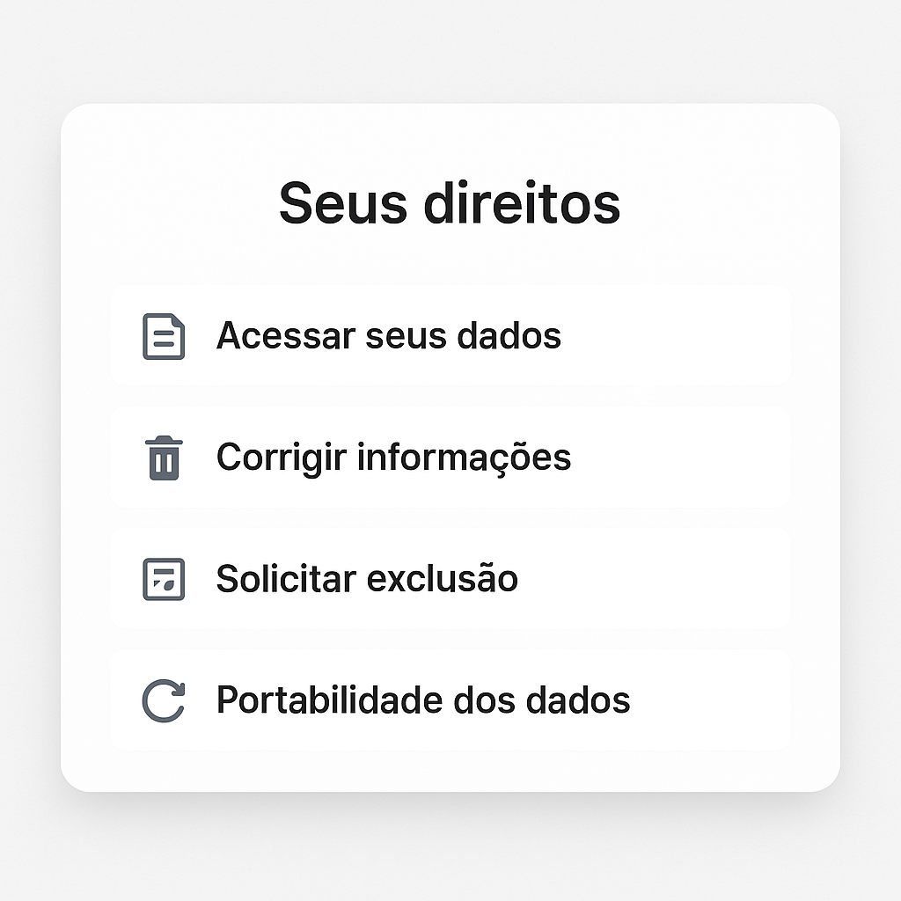

# 🔍 Art. 9º – Transparência e Informações Obrigatórias

> O titular tem direito ao **acesso facilitado às informações** sobre o tratamento de seus dados.  
> Essas informações devem ser apresentadas de forma **clara, adequada e ostensiva**.

O Art. 9º obriga o controlador a **informar o titular sobre como seus dados são tratados**, incluindo a finalidade, duração, compartilhamentos e seus direitos.

---

## 👨‍💻 Impacto para desenvolvedores

Falta de transparência é violação direta da LGPD; portanto o desenvolvedor deve garantir que:

- Interfaces e APIs mostrem **por que** e **como** os dados estão sendo usados;
- O sistema indique **quem trata os dados e com quem eles são compartilhados**;
- Os direitos do usuário estejam **acessíveis, visíveis e fáceis de exercer**;
- O backend mantenha **registros de responsabilidade e acesso**.

---

## 🔎 O que o Art. 9º exige?

| Informação obrigatória       | O que deve conter                                | Observações importantes                                   |
| ---------------------------- | ------------------------------------------------ | --------------------------------------------------------- |
| Finalidade específica        | Por que os dados estão sendo tratados            | Mostrar claramente ao titular antes da coleta             |
| Forma e duração              | Como os dados serão tratados e por quanto tempo  | Considerar sigilo comercial e justificativa para retenção |
| Identificação do controlador | Nome e CNPJ do responsável                       | Deve estar visível em contratos e termos                  |
| Contato do controlador       | Canal direto para dúvidas e requisições          | Ex: e-mail, telefone, formulário                          |
| Compartilhamento de dados    | Com quem os dados serão compartilhados e por quê | Incluir parceiros e serviços terceiros                    |
| Responsabilidades            | Quem tem acesso e quem realiza o tratamento      | Devem estar definidos e rastreáveis                       |
| Direitos do titular          | Explicitar os direitos conforme o Art. 18        | Acesso, correção, exclusão, portabilidade etc.            |

---

## 💡 Boas Práticas para Transparência

### 1. Tela de transparência no sistema

Exiba diretamente na interface uma seção com as seguintes informações:

- 📌 Finalidade: melhorar recomendações e personalizar ofertas

- ⏳ Duração: enquanto durar sua conta ativa

- 🏢 Controlador: ACME Ltda – CNPJ 00.000.000/0001-00

- 📞 Contato: privacidade@acme.com

- 🔗 Compartilhamentos: Google Analytics, Mailchimp

### 2. Endpoint de transparência acessível

- 📬 Criar rota específica para o usuário consultar como seus dados são usados;
- 🧾 Informar finalidade, duração, responsáveis e terceiros.

```js
app.get("/meus-dados/info", async (req, res) => {
  const userId = req.user.id;
  const info = await getTransparencyDetails(userId);
  res.status(200).json(info);
});
```

### 3. Registro técnico sobre exposição de dados

- 🗂️ Guarde a evidência de que o titular foi informado sobre o tratamento dos dados;
- 🕒 Registre a finalidade, retenção, terceiros envolvidos e o momento da comunicação;

```sql
CREATE TABLE transparency_audit (
  id SERIAL PRIMARY KEY,
  user_id INTEGER REFERENCES users(id),
  purpose TEXT,
  shared_with TEXT,
  retention TEXT,
  controller_contact TEXT,
  informed_at TIMESTAMP DEFAULT CURRENT_TIMESTAMP
);
```

### 4. Atualização de informações ao mudar finalidade

- 🔁 Sempre que a finalidade mudar, informe o usuário;
- ❗ Se ele não concordar, pare o tratamento imediatamente;
- 📅 Use versão de política e histórico de aceite.

### 5. Página dedicada aos direitos do titular

- 👁️ Listar direitos garantidos pelo Art. 18;
- 🔄 Incluir botões para exercer cada direito: acesso, correção, exclusão, portabilidade.

Exemplo de apresentação na tela:



## 🎯 Conclusão

O Art. 9º exige que a privacidade seja também visível e compreensível.
Não basta proteger, é preciso informar e provar que o usuário sabe o que está sendo feito.

Como dev, você deve garantir que:

- 📢 O titular entenda claramente como seus dados são tratados;
- 📊 As informações estejam disponíveis e atualizadas;
- 🧾 Registros e evidências estejam prontos para qualquer auditoria.

> 🔐 **Transparência não é um banner de cookies. É arquitetura, UX e responsabilidade.**
